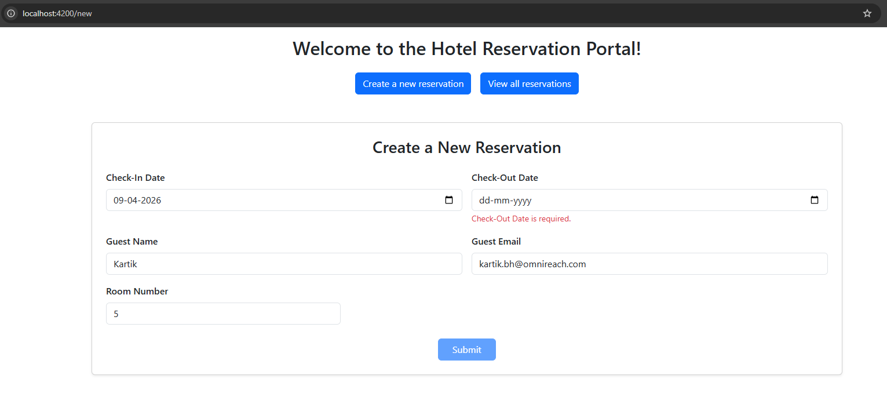
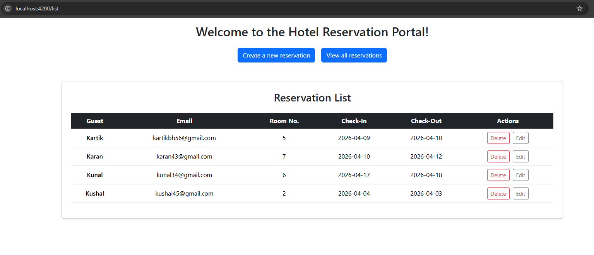
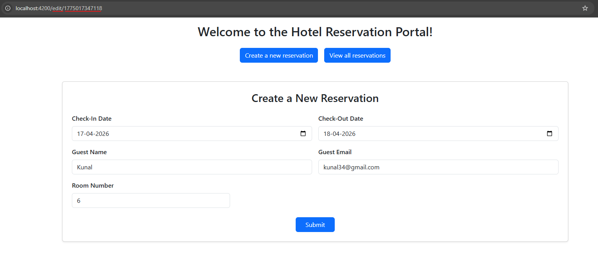

# 🏨 Hotel Reservation App (Angular)

A simple CRUD-based Hotel Reservation application built using Angular.  
Users can create, view, edit, and delete reservations with form validation.






---

## 🚀 Features

- Create a new reservation
- View all reservations
- Edit existing reservations
- Delete reservations
- Form validation using Reactive Forms
- Data persistence using `localStorage`

---

## 🛠️ Tech Stack

- Angular
- TypeScript
- Reactive Forms (`FormGroup`, `FormBuilder`, `Validators`)
- Local Storage (for data persistence)

---

## 📂 Project Structure (Key Parts)

### Routes

```ts
const routes: Routes = [
  { path: "", component: HomeComponent },
  { path: "list", component: ReservationListComponent },
  { path: "new", component: ReservationFormComponent },
  { path: "edit/:id", component: ReservationFormComponent }
];
```

---

### Reservation Model

```ts
export interface Reservation {
  id: string;
  checkInDate: Date;
  checkOutDate: Date;
  guestName: string;
  guestEmail: string;
  roomNumber: number;
}
```

---

### Service (Core Logic)

Handles all CRUD operations and stores data in `localStorage`.

```ts
@Injectable({
  providedIn: 'root',
})
export class ReservationService {
  private reservations: Reservation[] = [];

  constructor() {
    let savedReservations = localStorage.getItem('reservations');
    this.reservations = savedReservations ? JSON.parse(savedReservations) : [];
  }

  getReservations(): Reservation[] {
    return this.reservations;
  }

  getReservation(id: string): Reservation | undefined {
    return this.reservations.find((res) => res.id === id);
  }

  addReservation(reservation: Reservation): void {
    reservation.id = Date.now().toString();
    this.reservations.push(reservation);
    localStorage.setItem('reservations', JSON.stringify(this.reservations));
  }

  deleteReservation(id: string): void {
    let index = this.reservations.findIndex((res) => res.id === id);
    this.reservations.splice(index, 1);
    localStorage.setItem('reservations', JSON.stringify(this.reservations));
  }

  updateReservation(id: string, updatedReservation: Reservation): void {
    let index = this.reservations.findIndex((res) => res.id === id);
    this.reservations[index] = updatedReservation;
    localStorage.setItem('reservations', JSON.stringify(this.reservations));
  }
}
```

---

## 🧾 Form Validation

Implemented using Angular Reactive Forms:

- `FormGroup` for managing form state
- `FormBuilder` for cleaner form creation
- `Validators` for input validation

---

## 💾 Data Storage

- Uses browser `localStorage`
- No backend required
- Data persists across page reloads

---

## ▶️ Getting Started

### 1. Clone the repository

```bash
git clone <your-repo-url>
cd hotel-reservation-app
```

### 2. Install dependencies

```bash
npm install
```

### 3. Run the app

```bash
ng serve
```

Navigate to:
http://localhost:4200

